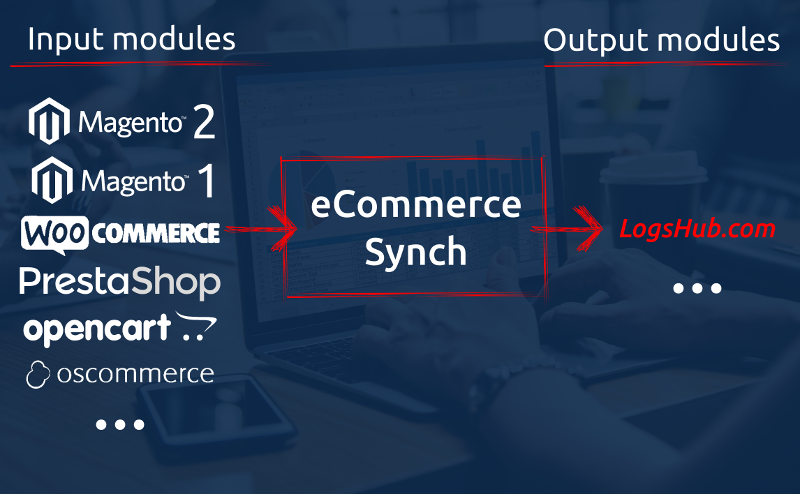

# eCommerce Synch



This is NOT a plugin to any of eCommerce platform. This is standalone application
that process data from store's database (by modules for specific platform) into
other system eg. LogsHub.com search service.

### Supported eCommerce platforms

* Magento 1 (1.6.2.0 - 1.9.4.1)
* Magento 2 (2.3.0)
* WooCommerce (5.1.1)
* PrestaShop (1.6.1.10 - 1.7.5.1)
* OpenCart (2.1.0.2 - X)
* osCommerce (2.3.4.1 - 2.4.2)
* Sylius (1.4.3)

Other versions might work as well, but was not tested.

### How does it work

Cron executes synchronization command. It takes configuration file, determine what is input module.
It executes its SQL SELECT statements and saves result into CSV files (products and categories).
Output module push CSV data into remote system eg. LogsHub.com search service.

### Requirements

* PHP 7 (PDO, pdo_mysql)
* Composer - https://getcomposer.org/

### Installation (easy)

That way is OK for small and medium stores.
It is easier to setup, but little bit less optimal,
as CSV files will be generated by PHP code insetad of database itself.

1. `composer require logshub/ecommerce-synch`
2. `cp ecommerce-synch/config.example.ini ecommerce-synch/config.ini`
3. Setup your `ecommerce-synch/config.ini`: logshub credentials, input module and database connection. Set `generate_csv_by_database = 0` (easy configuration).
4. Add into your cron: `php vendor/bin/ecommerce-synch synch -c config.ini`. Frequency depends on configuration (see `check_update_dates`).

Example:

```
cd /var/www/
mkdir ecommerce-synch
cd ecommerce-synch/
composer require logshub/ecommerce-synch
cp vendor/logshub/ecommerce-synch/config.example.ini config.ini
# setup credentials + input module
nano config.ini
# test synchronization
php /var/www/ecommerce-synch/vendor/bin/ecommerce-synch synch -c /var/www/ecommerce-synch/config.ini
# setup cron
crontab -e
# paste similar to the following:
5 * * * * php /var/www/ecommerce-synch/vendor/bin/ecommerce-synch synch -c /var/www/ecommerce-synch/config.ini > /tmp/ecommerce-synch.log
```

### Installation (experimental, advanced)

It is more advanced setup, but more optimal,
as CSV files will be generated by database itself insetad of PHP code.

1. Make sure you run this code on the same server with database - access to `/var/lib/mysql-files/` needed.
2. Your DB user must have `FILE` privilege in database (see below).
3. Process with the "easy" installation steps with this exception: `generate_csv_by_database = 1`.

AD 2

```
GRANT FILE ON *.* TO myuser;
FLUSH PRIVILEGES;
```

### How to create input module?

There could be cases when your database structure is little bit different then the standard ones.
You can create your own module, that match your database structre.

```
composer require logshub/ecommerce-synch
# setup files like below...
composer dump-autoload
```

Example project structure 

```
├── composer.json
├── modules.php
└── src
    └── Module
        └── Input
            └── MyStoreCom.php
```

Content of `composer.json`

```
{
    "require": {
        "logshub/ecommerce-synch": "dev-master"
    },
    "autoload": {
        "files": [
            "modules.php"
        ],
        "psr-4": {
            "MyStore\\": "src"
        }
    }
}
```

Content of `modules.php`, that is loaded automatically by composer.

```
<?php
use Logshub\EcommerceSynch\Module\Registrar;

Registrar::registerInput(new \MyStore\Module\Input\MyStoreCom());
```

Content of `src/Module/Input/MyStoreCom.php` file with your custom module.

```
<?php
namespace MyStore\Module\Input;

class MyStoreCom extends \Logshub\EcommerceSynch\Module\Input\ModuleAbstract
{
    /**
     * @return Name that 
     */
    public function getName()
    {
        return 'my-store.com';
    }

    public function getProductsSql(\DateTime $time = null)
    {
        $sql = "SELECT 'id', 'name', 'url', 'url_image', 'price', 'price_old', 'currency', 'description', 'categories', 'sku'";
        // UNION
        // SELECT p.id, p.name, p.url, p.url_image, p.price, p.price_old, p.currency, p.description, p.categories, p.sku FROM product AS p WHERE p.enabled = 1

        // if (!empty($time)) {
        //     $sql .= " AND p.updated_at >= '".$time->format('Y-m-d H:i:s')."' ";
        // }

        return $sql;
    }

    public function getCategoriesSql(\DateTime $time = null)
    {
        $sql = "SELECT 'id', 'name', 'url', 'url_image'";
        // UNION
        // SELECT c.id, c.name, c.url, c.url_image FROM categories AS c WHERE c.enabled = 1

        // if (!empty($time)) {
        //     $sql .= " AND c.updated_at >= '".$time->format('Y-m-d H:i:s')."' ";
        // }

        return $sql;
    }

    public function getCurrentIdsSql()
    {
        return 'SELECT 1';
        // SELECT p.id FROM product AS p WHERE p.enabled = 1
        // UNION
        // SELECT c.id FROM categories AS c WHERE c.enabled = 1
    }
}
```

Now, you can configure `input.module` in `config.ini` to use your custom module (from `MyStoreCom::getName`).

```
[input]
module = "my-store.com"
```

### Troubleshooting

* last updated time is not calculated correctly: make sure timezone is the same on the PHP and database side

### TODO

* clear old CSV files (new command)
* callback for database dump

### Input modules to do

* ShopWare
* Ubercart - https://www.drupal.org/project/ubercart 
* Spree - https://github.com/spree/spree
